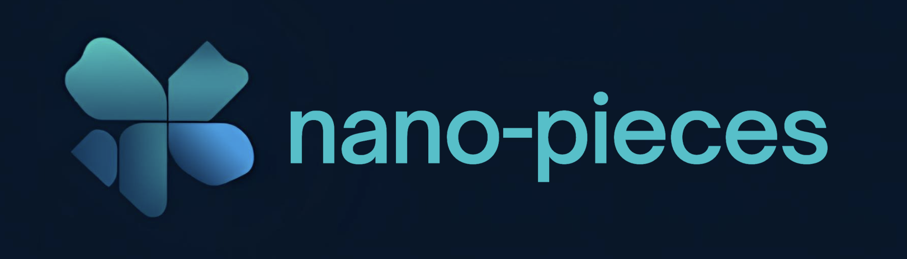

<p align="center">
  
</p>

<p align="center">
  <strong>The missing UI skills pack for AI agents.</strong>
</p>

<p align="center">
  <a href="https://www.npmjs.com/package/@ez-cook/nano-peaces"></a>
  <a href="https://github.com/ez-cook/nano-peaces/actions/workflows/ci.yml"></a>
  <a href="https://github.com/ez-cook/nano-peaces/blob/main/LICENSE"></a>
</p>

---

`nano-peaces` gives your AI coding agent (Cursor, Claude Code, Antigravity, etc.) expert-level knowledge about UI component libraries — so it stops guessing and starts writing production-quality UI code.

## The Problem

AI agents write plausible-looking UI code, but they:

- Use deprecated APIs and outdated patterns
- Miss critical accessibility attributes
- Don't know about new component systems (e.g., shadcn/ui Field+Controller pattern)
- Generate code that looks right but breaks at runtime

**nano-peaces** fixes this by injecting structured, up-to-date skill files directly into your agent's context.

## Quick Start

```bash
npx nano-peaces init
```

That's it. The CLI will:

1. **Detect** your project stack (Next.js, Tailwind, shadcn/ui, etc.)
2. **Ask** which AI agent you use
3. **Install** matching skill files in the right format

## Supported Agents

| Agent           | Output Format                  | Location         |
| --------------- | ------------------------------ | ---------------- |
| **Antigravity** | Markdown + chunks + registry   | `.agent/skills/` |
| **Claude Code** | Single combined CLAUDE.md      | `CLAUDE.md`      |
| **Cursor**      | MDC rules with glob activation | `.cursor/rules/` |
| **Generic**     | Markdown + chunks              | `.ai/skills/`    |

## Commands

```bash
nano-peaces init              # Set up nano-peaces in your project
nano-peaces init --agent cursor --yes  # Non-interactive setup
nano-peaces add shadcn-ui     # Add a specific skill
nano-peaces add --all         # Add all recommended skills
nano-peaces list              # Show available / installed skills
nano-peaces update            # Update skills (coming in v0.2)
```

## Available Skills

| Skill       | Description                                                                                                                    |
| ----------- | ------------------------------------------------------------------------------------------------------------------------------ |
| `shadcn-ui` | Expert shadcn/ui knowledge — 2026 patterns, Field+Controller forms, unified Radix imports, oklch theming, all major components |

More skills coming soon: Tailwind CSS, React patterns, accessibility, etc.

## How It Works

### 3-Layer Architecture

```
Layer 1: registry.json    (~100 tokens)  → Signal matching — when to activate
Layer 2: SKILL.md         (~400 tokens)  → Core knowledge — always loaded
Layer 3: chunks/*.md    (200-800 tokens)  → Deep knowledge — loaded on demand
```

The agent reads Layer 1 to decide if a skill is relevant, loads Layer 2 for the mental model, then pulls specific chunks from Layer 3 as needed. This keeps context usage minimal while providing deep expertise.

### Project Fingerprinting

nano-peaces automatically detects:

- **Framework**: Next.js, Vite, Remix, Astro, CRA
- **UI Libraries**: shadcn/ui (multi-signal detection), Carbon, Mantine, Headless UI, daisyUI, Ark UI
- **Styling**: Tailwind CSS, styled-components, Sass
- **Language**: TypeScript / JavaScript
- **Router**: App Router, Pages Router, React Router, TanStack Router
- **State**: Zustand, Jotai, Redux, Recoil, Valtio
- **Forms**: React Hook Form, Formik

## What's in the shadcn/ui Skill?

The skill pack includes up-to-date knowledge for:

- **Installation** — framework matrix, prerequisites, primitive choices (Radix vs Base UI)
- **Configuration** — components.json schema, monorepo setup, alias paths
- **Theming** — oklch color system, CSS variables, dark mode with next-themes
- **Button** — variants, sizes, data-icon convention, asChild, cursor override
- **Dialog/Sheet/Drawer** — modal patterns, responsive dialog↔drawer, Alert Dialog
- **Forms** — 2026 Field+Controller pattern (NOT the old Form/FormField), zod validation, array fields
- **Data Table** — TanStack Table integration, progressive features (sort, filter, paginate, select)
- **Sidebar** — full component hierarchy, variants, collapsible menus, useSidebar hook
- **Navigation** — Breadcrumb, Tabs, NavigationMenu, Pagination
- **Composition** — cn(), asChild, data-icon, cva(), extending components
- **Anti-patterns** — 10 critical mistakes with corrections, deprecated patterns, migration commands

## Contributing

### Adding a New Skill

1. Create `packages/skills/{skill-id}/SKILL.md` (Layer 2)
2. Create `packages/skills/{skill-id}/chunks/*.md` (Layer 3)
3. Add entry to `packages/skills/registry.json` (Layer 1)
4. Run `pnpm build && pnpm test`

### Development

```bash
git clone https://github.com/ez-cook/nano-peaces.git
cd nano-peaces
pnpm install
pnpm build
pnpm test
```

## License

MIT
